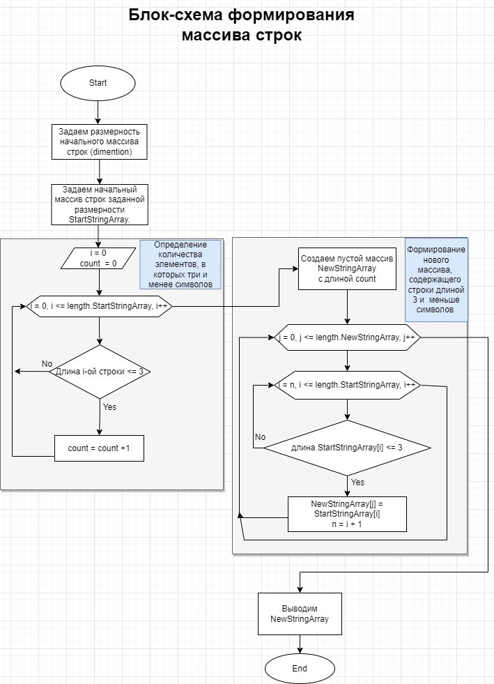

# **Описание решения задачи**

Задача решается путем последовательной реализации нескольких методов:
* метода, задающего размерность начального массива строк
* метода, задающего начальный массив строк заданной размерности
* метода подсчет количества элементов начального массива, в которых три и менее символов
* метода формирования нового массива строк

 Результаты выполнения каждого из методов выводятся в консоль.

## 1. Метод, задающий размерности начального массива строк

* В качестве аргумента метод получает сообщение: *"Укажите размерность"*, а возвращает целое число большее нуля.
* Метод будет проверять корректность введенных пользователем данных, а именно, ввел ли пользователь целое число большее нуля. 

## 2. Метод, задающий начальный массив строк заданной размерностью
* В качестве аргумента метод принимает целое число большее нуля, соответствующее размерности массива. Метод возвращает массив строк.
* Каждый элемент массива строк вводится пользователем с клавиатуры, после соответствующего запроса. 

## 3. Метод подсчета количества элементов начального массива, в которых три и менее символов

* В качестве аргумента метод принимает массив строк и возвращает целое число равное количеству строк нужной длины. 
* Реализуется метод путем выполнения цикла for и проверки условия: *"длина i-ого элемента начального массива строк <= 3"*.

## 4. Метода формирования нового массива строк

 * В качестве аргумента метод принимает начальный массив строк, размерность начального массива строк и количество элементов начального массива. Метод возвращает новый массив строк, длина которых меньше или равна 3 символа. 
 * Реализуется метод заданием пустого массива длиной равной числу определенной в результате метода подсчета количества элементов начального массива, в которых три и менее символов. Далее, последовательно каждому значению нового массива присваивается значение начального массива, в которых меньше или 3 символа. 

## Блок-схема решения задачи
 
